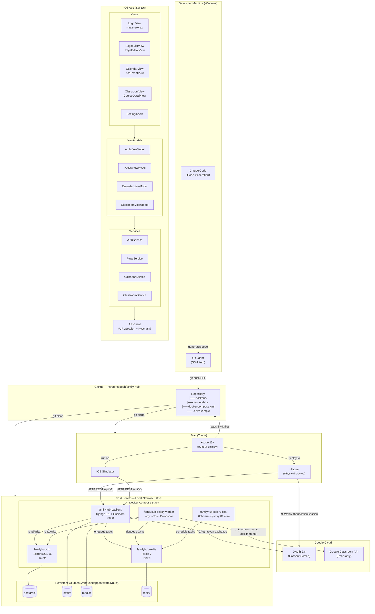
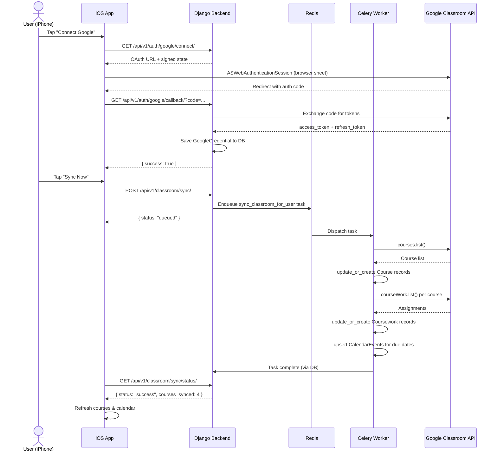
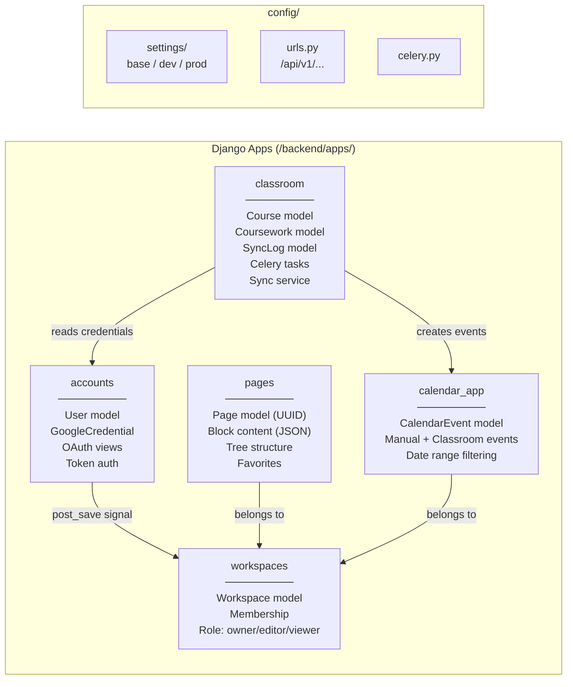
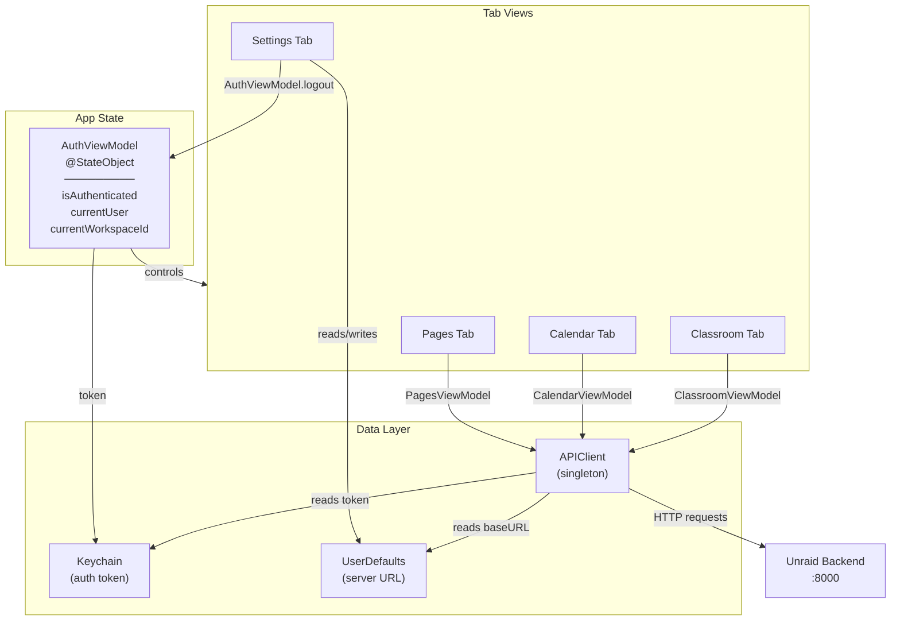
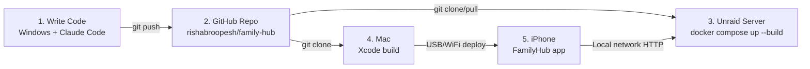

# FamilyHub Architecture

## System Overview

```mermaid
graph TB
    subgraph DEV["Developer Machine (Windows)"]
        CLAUDE["Claude Code\n(Code Generation)"]
        GIT["Git Client\n(SSH Auth)"]
    end

    subgraph GITHUB["GitHub — rishabroopesh/family-hub"]
        REPO["Repository\n├── backend/\n├── frontend-ios/\n├── docker-compose.yml\n└── .env.example"]
    end

    subgraph MAC["Mac (Xcode)"]
        XCODE["Xcode 15+\n(Build & Deploy)"]
        SIM["iOS Simulator"]
        DEVICE["iPhone\n(Physical Device)"]
    end

    subgraph GOOGLE["Google Cloud"]
        OAUTH["OAuth 2.0\n(Consent Screen)"]
        CLASSROOM_API["Google Classroom API\n(Read-only)"]
    end

    subgraph UNRAID["Unraid Server — Local Network :8000"]
        direction TB

        subgraph DOCKER["Docker Compose Stack"]
            BACKEND["familyhub-backend\nDjango 5.1 + Gunicorn\n:8000"]
            WORKER["familyhub-celery-worker\nAsync Task Processor"]
            BEAT["familyhub-celery-beat\nScheduler (every 30 min)"]
            DB["familyhub-db\nPostgreSQL 16\n:5432"]
            REDIS["familyhub-redis\nRedis 7\n:6379"]
        end

        subgraph VOLUMES["Persistent Volumes (/mnt/user/appdata/familyhub/)"]
            VOL_PG[("postgres/")]
            VOL_STATIC[("static/")]
            VOL_MEDIA[("media/")]
            VOL_REDIS[("redis/")]
        end
    end

    subgraph IOS["iOS App (SwiftUI)"]
        direction TB
        APICLIENT["APIClient\n(URLSession + Keychain)"]
        subgraph VIEWS["Views"]
            V1["LoginView\nRegisterView"]
            V2["PagesListView\nPageEditorView"]
            V3["CalendarView\nAddEventView"]
            V4["ClassroomView\nCourseDetailView"]
            V5["SettingsView"]
        end
        subgraph VMS["ViewModels"]
            VM1["AuthViewModel"]
            VM2["PagesViewModel"]
            VM3["CalendarViewModel"]
            VM4["ClassroomViewModel"]
        end
        subgraph SERVICES["Services"]
            S1["AuthService"]
            S2["PageService"]
            S3["CalendarService"]
            S4["ClassroomService"]
        end
    end

    %% Developer workflow
    CLAUDE -->|generates code| GIT
    GIT -->|git push SSH| REPO
    REPO -->|git clone| MAC
    REPO -->|git clone| UNRAID

    %% Xcode builds app
    XCODE -->|reads Swift files| REPO
    XCODE -->|run on| SIM
    XCODE -->|deploy to| DEVICE

    %% iOS app communicates with backend
    DEVICE -->|HTTP REST /api/v1/| BACKEND
    SIM -->|HTTP REST /api/v1/| BACKEND

    %% Django internal connections
    BACKEND -->|read/write| DB
    BACKEND -->|enqueue tasks| REDIS
    WORKER -->|dequeue tasks| REDIS
    WORKER -->|read/write| DB
    BEAT -->|schedule tasks| REDIS

    %% Volume mounts
    DB --- VOL_PG
    BACKEND --- VOL_STATIC
    BACKEND --- VOL_MEDIA
    REDIS --- VOL_REDIS

    %% Google integrations
    BACKEND -->|OAuth token exchange| OAUTH
    WORKER -->|fetch courses & assignments| CLASSROOM_API
    DEVICE -->|ASWebAuthenticationSession| OAUTH

    %% iOS internal structure
    VIEWS --> VMS
    VMS --> SERVICES
    SERVICES --> APICLIENT
```

---

## Request Flow: Google Classroom Sync

```mermaid
sequenceDiagram
    actor User as User (iPhone)
    participant App as iOS App
    participant Backend as Django Backend
    participant Redis as Redis
    participant Worker as Celery Worker
    participant Google as Google Classroom API

    User->>App: Tap "Connect Google"
    App->>Backend: GET /api/v1/auth/google/connect/
    Backend-->>App: OAuth URL + signed state
    App->>Google: ASWebAuthenticationSession (browser sheet)
    Google-->>App: Redirect with auth code
    App->>Backend: GET /api/v1/auth/google/callback/?code=...
    Backend->>Google: Exchange code for tokens
    Google-->>Backend: access_token + refresh_token
    Backend->>Backend: Save GoogleCredential to DB
    Backend-->>App: { success: true }

    User->>App: Tap "Sync Now"
    App->>Backend: POST /api/v1/classroom/sync/
    Backend->>Redis: Enqueue sync_classroom_for_user task
    Backend-->>App: { status: "queued" }

    Redis->>Worker: Dispatch task
    Worker->>Google: courses.list()
    Google-->>Worker: Course list
    Worker->>Worker: update_or_create Course records
    Worker->>Google: courseWork.list() per course
    Google-->>Worker: Assignments
    Worker->>Worker: update_or_create Coursework records
    Worker->>Worker: upsert CalendarEvents for due dates
    Worker->>Backend: Task complete (via DB)

    App->>Backend: GET /api/v1/classroom/sync/status/
    Backend-->>App: { status: "success", courses_synced: 4 }
    App->>App: Refresh courses & calendar
```

---

## Django Backend App Structure

```mermaid
graph LR
    subgraph APPS["Django Apps (/backend/apps/)"]
        direction TB
        ACC["accounts\n─────────\nUser model\nGoogleCredential\nOAuth views\nToken auth"]
        WS["workspaces\n─────────\nWorkspace model\nMembership\nRole: owner/editor/viewer"]
        PG["pages\n─────────\nPage model (UUID)\nBlock content (JSON)\nTree structure\nFavorites"]
        CAL["calendar_app\n─────────\nCalendarEvent model\nManual + Classroom events\nDate range filtering"]
        CL["classroom\n─────────\nCourse model\nCoursework model\nSyncLog model\nCelery tasks\nSync service"]
    end

    subgraph CONFIG["config/"]
        SETTINGS["settings/\nbase / dev / prod"]
        URLS["urls.py\n/api/v1/..."]
        CELERY_CFG["celery.py"]
    end

    ACC -->|post_save signal| WS
    CL -->|creates events| CAL
    CL -->|reads credentials| ACC
    PG -->|belongs to| WS
    CAL -->|belongs to| WS
```

---

## iOS App Data Flow

```mermaid
graph TD
    subgraph STATE["App State"]
        AUTH_VM["AuthViewModel\n@StateObject\n─────────\nisAuthenticated\ncurrentUser\ncurrentWorkspaceId"]
    end

    subgraph TABS["Tab Views"]
        T1["Pages Tab"]
        T2["Calendar Tab"]
        T3["Classroom Tab"]
        T4["Settings Tab"]
    end

    subgraph DATA["Data Layer"]
        KC["Keychain\n(auth token)"]
        UD["UserDefaults\n(server URL)"]
        API["APIClient\n(singleton)"]
    end

    AUTH_VM -->|token| KC
    AUTH_VM -->|controls| TABS

    T1 -->|PagesViewModel| API
    T2 -->|CalendarViewModel| API
    T3 -->|ClassroomViewModel| API
    T4 -->|reads/writes| UD
    T4 -->|AuthViewModel.logout| AUTH_VM

    API -->|reads token| KC
    API -->|reads baseURL| UD
    API -->|HTTP requests| BACKEND["Unraid Backend\n:8000"]
```

---

## Deployment Pipeline

```mermaid
graph LR
    A["1. Write Code\nWindows + Claude Code"] -->|git push| B["2. GitHub Repo\nrishabroopesh/family-hub"]
    B -->|git clone/pull| C["3. Unraid Server\ndocker compose up --build"]
    B -->|git clone| D["4. Mac\nXcode build"]
    D -->|USB/WiFi deploy| E["5. iPhone\nFamilyHub app"]
    E -->|Local network HTTP| C
```
